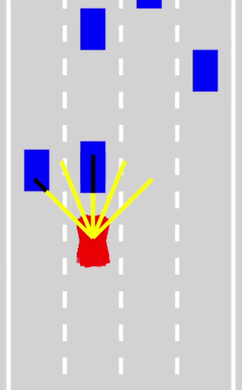

# 🚗 Self-Driving Car Simulation using Neural Networks & Genetic Algorithms

## Overview

This project implements a **self-learning car simulation** where a car learns to navigate through a track using a neural network that is trained through **genetic algorithms**. The entire project is built using **Object-Oriented Programming (OOP)** principles, providing a modular, clean, and extensible design.

The car simulation involves cars improving over generations, where the best-performing cars pass their knowledge (weights and biases) to the next generation. The core idea is inspired by **natural selection**, where each generation of cars "evolves" by selecting the fittest and introducing random mutations.

---

## Features

- **Neural Network**: The cars use simple feedforward neural networks to make decisions (steering, acceleration).
- **Genetic Algorithm**: The neural networks are trained using a genetic algorithm that selects the best-performing cars and applies crossover and mutation to create the next generation.
- **Object-Oriented Design**: Key components like Car, NeuralNetwork, and Controls are modeled as separate classes.
- **Simulation Environment**: A track and cars are rendered in a 2D environment (using Canvas).
- **Collision Detection**: Each car can sense the track boundaries using sensors and adjust its movement accordingly.
- **Fitness Function**: Cars are evaluated based on their distance traveled on the track without crashing.
- **Real-time Visualization**: Watch cars improve their performance across generations as they learn to drive through the track.

---

## Demo




---

## How It Works

### Genetic Algorithm Flow:

1. **Initialization**: A population of cars is created with random neural networks.
2. **Evaluation**: Each car navigates the track. The car's performance is evaluated using a fitness function (e.g., distance traveled).
3. **Selection**: The best-performing cars are selected based on their fitness scores.
4. **Crossover**: Neural networks from selected cars are combined to create new cars for the next generation.
5. **Mutation**: Random changes are introduced to the neural network weights to ensure diversity and avoid local minima.
6. **Next Generation**: The process repeats for several generations, gradually improving the performance of the cars.

---

## Installation & Running the Project

1. Clone this repository:

    ```bash
    git clone https://github.com/harshxll/Self-Driving-Car.git
    ```

2. Open the project directory:

    ```bash
    cd self-driving-car-simulation
    ```

3. Open `index.html` in your preferred browser to start the simulation:

    ```bash
    open index.html
    ```

    Alternatively, you can use a local server for a smoother experience:

    ```bash
    npx live-server
    ```

---


